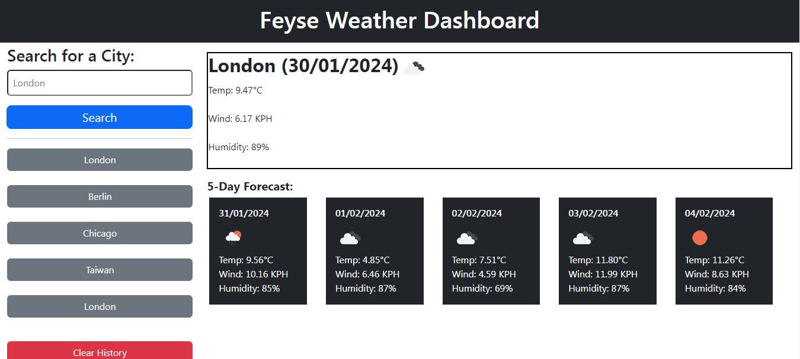

# Feyse Weather Dashboard

## Overview

The Weather Dashboard is a user-friendly web application designed for travelers to conveniently check the weather outlook for multiple cities. Utilizing the [5 Day Weather Forecast](https://openweathermap.org/forecast5) API, the dashboard retrieves accurate and up-to-date weather data for cities worldwide. Users can effortlessly view current and future weather conditions for a selected city, aiding them in planning their trips effectively.

## Features

### 1. City Search
Users can easily search for a specific city to access current and future weather conditions. The application leverages the OpenWeatherMap API to provide comprehensive and reliable weather information.

### 2. Search History
To enhance user experience, the dashboard maintains a search history. When users search for a city, it is added to the search history, enabling quick and convenient access to previously searched cities.

### 3. Current Weather Conditions
For the selected city, users are presented with detailed current weather conditions, including:
- The city name
- The date
- An icon representation of weather conditions
- The temperature
- The humidity
- The wind speed

### 4. 5-Day Forecast
Users can plan ahead by exploring the 5-day forecast for the selected city. The forecast includes:
- The date
- An icon representation of weather conditions
- The temperature
- The humidity

### 5. History Navigation
The dashboard facilitates easy navigation through the search history. Clicking on a city in the search history allows users to quickly view both current and future weather conditions for that city.

## How to Use

1. **Open the Weather Dashboard:** Launch the application in your preferred web browser.
2. **City Search:** Enter the name of the city you want to check the weather for in the provided form input.
3. **Search:** Click the search button to retrieve and display the weather information for the selected city.
4. **View Weather Conditions:** Explore the current and future weather conditions presented on the dashboard.
5. **Search History:** Use the search history feature to quickly access information for previously searched cities.

## Demo

You can access the live demo of the app at https://dodomiyake.github.io/feyse-weather-dashboard

### Screenshots

## Technologies Used

The Weather Dashboard is built using the following technologies:

- **HTML:** Provides the structure and layout of the web page.
- **CSS:** Styles the application for an appealing and user-friendly interface.
- **JavaScript:** Enhances the interactivity of the dashboard, facilitating dynamic updates based on user inputs.
- **[OpenWeatherMap API](https://openweathermap.org/api):** Retrieves accurate and real-time weather data for cities worldwide.
- **`localStorage`:** Stores persistent data, including search history, for an improved user experience.

## API Key

To use the OpenWeatherMap API, you will need to [register for an API key](https://openweathermap.org/appid). After obtaining the API key, wait up to 2 hours for activation.

## Installation

To run the Weather Dashboard locally, follow these steps:

1. Clone the repository: `git clone [repository-url]`
2. Open the project folder: `cd weather-dashboard`
3. Open the `index.html` file in your preferred web browser.

## Contribution

Contributions are welcome! Follow these steps to contribute to the Weather Dashboard:

1. Fork the repository.
2. Create a new branch: `git checkout -b feature/new-feature`
3. Make your changes and commit them: `git commit -m 'Add new feature'`
4. Push to the branch: `git push origin feature/new-feature`
5. Submit a pull request.

## Acknowledgments

- Special thanks to [OpenWeatherMap](https://openweathermap.org/) for providing the weather data API.

## Contact

- Email: [oluwadamilola.william@gmail.com](mailto:oluwadamilola.william@gmail.com)
- LinkedIn: [Oluwadamilola's LinkedIn Profile](https://www.linkedin.com/in/oluwadamilolaxajayi)
- GitHub: [Dodo Miyake on GitHub](https://github.com/dodomiyake)

Looking forward to connecting with you!

---
